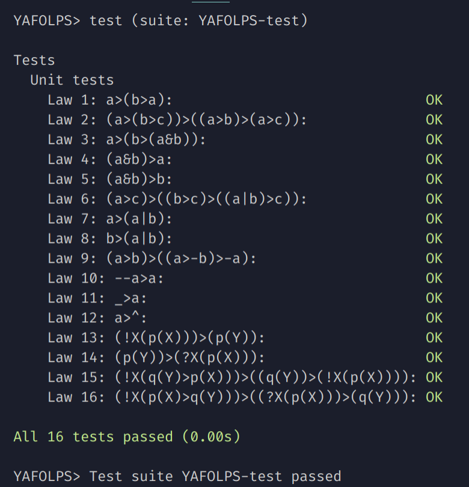

# YAFOLPS (Yet Another First-Order Logic Problem Solver)

#### Semester project on mathematical logic of the fourth semester of Software Engineering, Department of System Programming, Faculty of Mathematics and Mechanics, St. Petersburg State University. 

## Goal

#### We must determine whether the input formula in First-Order Logic is a tautology or not. For this to be done, we have implemented the resolution method.

## EBNF (Extended Backus–Naur form)

```
<Forall> ::= "!"
<Exists> ::= "?"
<LogicAnd> ::= "&"
<LogicOr> ::= "|"
<LogicNegation> ::= "-"
<LogicImplication> ::= ">"
<Top> ::= "^"
<Bottom> ::= "_"

<Char> ::= [a-z] | [A-Z] | [0-9] | "_"
<Var> ::= [A-Z] (<Char>)*
<Term> ::= <Var> | [a-z] (<Char>)* "(" ((<Term> ",")* <Term>) ")"

<Quantifier> ::= <Forall> | <Exists>
<LogicOperation> ::= <LogicAnd> | <LogicOr> | <LogicImplication>

<PredicateSymbol> ::= [a-z] (<Char>)* "(" ((<Term> ",")* <Term>) ")"

<Singleton> ::= <Top> | <Bottom> | <PredicateSymbol>
<Formula> ::= <Singleton> | "(" <Formula> ")"
  | <Formula> <LogicOperation> <Formula> 
  | <Quantifier> <Var> "(" <Formula> ")" 
```

# Usage

## ``stack build && stack exec -- YAFOLPS-exe <args>``

## Args

* ``--input-file filename / --i filename -- Reads a formula from a file. Without specifying this option reads a formula from standard input.``
* ``--print-formula / -f -- Prints the formula that have been read.``
* ``--print-ast / -a -- Prints the AST of the formula.``
* ``--print-ssf / -s -- Prints the SSF of the negated formula.``
* ``--print-solution / -r -- Prints "VALID" if is the formula is a tautology, otherwise prints "NOT VALID".``
  
## Examples

* ``stack build && stack exec -- YAFOLPS-exe --i examples/1.txt -fas`` -- ``Prints formula, AST and SSF``
* ``stack build && stack exec -- YAFOLPS-exe --i examples/1.txt -r`` ``-- Prints "NOT VALID"``
* ``stack build && stack exec -- YAFOLPS-exe --i examples/2.txt -r`` ``-- Prints "NOT VALID"``
* ``stack build && stack exec -- YAFOLPS-exe --i examples/3.txt -r`` ``-- Prints "NOT VALID"``
* ``stack build && stack exec -- YAFOLPS-exe --i examples/4.txt -r`` ``-- Prints "VALID"``
* ``stack build && stack exec -- YAFOLPS-exe --i examples/Top.txt -r`` ``-- Prints "VALID"``
* ``stack build && stack exec -- YAFOLPS-exe --i example/Bottom.txt -r`` ``-- Prints "VALID"``

## Tests

* ``stack test`` -- ``Prints results on the Hilbert's axioms``

